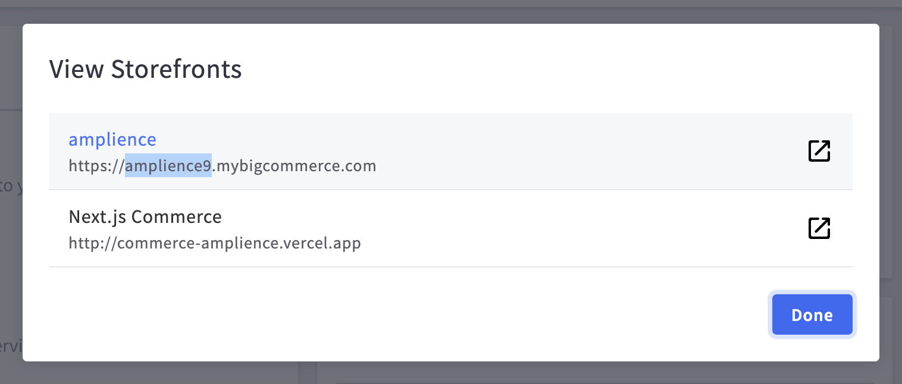

# BigCommerce CORS

## `bigCommerceCodec`
Location: `src/codec/codecs/bigcommerce-cors`

Connects to a BigCommerce instance via the GraphQL Storefront API, compatible with CORS. This backend does not support listing customer groups. See [BigCommerce](./bigcommerce-cors.md) for a backend that doesn't supports CORS, but has customer group functionality.

> Note: This implementation uses the Big Commerce GraphQL API

### Configuration

```json
{
    "vendor": "bigcommerce-cors",
    "codec_params": {
        "site_id": "<bigcommerce site id>",
        "api_token": "<bigcommerce graphql storefront api token>",
    }
}
```

## Configuration on the vendor side

`site_id` is easy to find, just click "View Storefronts" in the sidebar and use the string that appears before `.mybigcommerce.com`.



To create a GraphQL API token, you must first create a store-level API account.

### Create Store-level API account

Go to `Settings > Store-level API Tokens` and create API Account.


Select the account type V3 API token. Take note of the API path.


Select the required scopes:
- `Storefront API tokens`


### Get API credentials

Your credentials can now be accessed (one time), you will need the API URL (`https://api.bigcommerce.com`), the API token and the store hash captured previously. This should be recorded for the creation of tokens in the future.


### Use Store-level API to create a GraphQL Storefront API Token

You can use your new API account to create a GraphQL Storefront API Token for this backend. The only way of doing this is via directly sending a request to the API, which can be done with a tool such as Insomnia and Postman.

`POST https://api.bigcommerce.com/stores/{{STORE_HASH}}/v3/storefront/api-token`

Required header:

```
X-Auth-Token: <API token from previous step>
```

Body:

```json
{
  "channel_id": 1,            // integer (must be a valid channel ID on the store)
  "expires_at": 1602288000,   // when the token will expire, as an integer unix timestamp (in seconds)
  "allowed_cors_origins": [   // array of origins (up to 2 origins per token are allowed)
    "https://example.com"
  ]
}
```

This will return a JSON object containing your GraphQL Storefront API Token, which you can use as the `api_token` in the vendor config. 

Make sure allowed CORS origins include all areas you may access the API from, such as the URLs for extensions you will use, or localhost (optionally with a port) for testing the extensions locally.

The expiry date can be rather far in the future (such as in a year), though you should make sure to renew your token before it expires.

> Note: At the time of this release there is no way of generating this token from the Big Commerce UI directly or from a CORS request which is why the documentation is reflected to generate this.